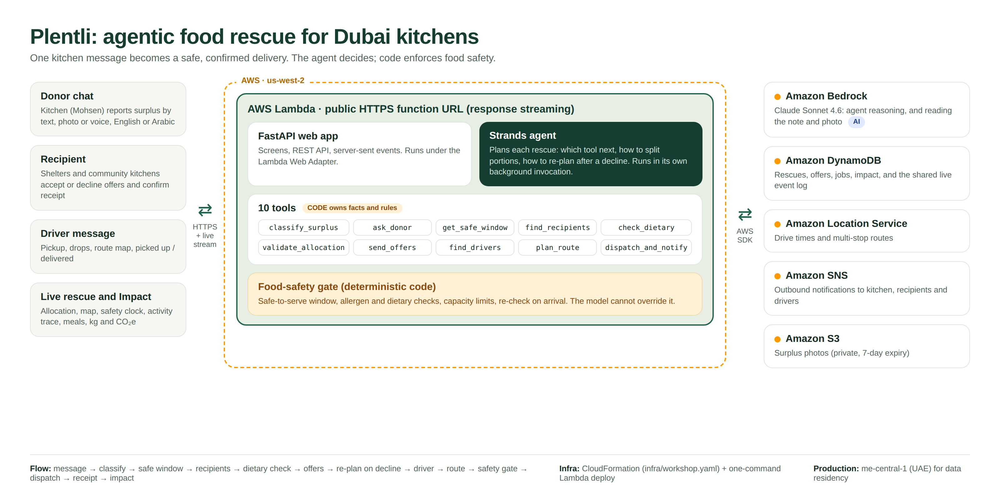

# Plentli

## Design references

The [visual gallery](gallery.html) contains eleven concept boards. See the [brand guidelines](BRAND.md), [interface guidelines](DESIGN.md), and [screen map](SCREEN_MAP.md) for the Plentli design direction. The app's screens follow these designs.

**Agentic food rescue for Dubai kitchens.** A kitchen sends one message about leftover food. An AI agent works out what the food is and how long it stays safe, finds charities that can use it tonight, and books a van to get it there in time. Code enforces every food-safety rule.

Built at the AWS Summit hackathon (Idea 2, "WasteNot").

## Impact statement

Every night, commercial kitchens in Dubai throw away cooked food that is still safe to eat, while shelters, labour camps and community fridges a few kilometres away run short. The food is rarely wasted because nobody wants it. It is wasted because rescuing it takes phone calls, and the food only stays safe for a few hours.

At HelloChef's Al Quoz kitchen, Mohsen (kitchen operations lead) sees about **[XX] portions** left over on a typical night. Today, most of it goes in the bin because arranging a pickup takes **[XX] minutes** of calls he doesn't have at the end of a shift.

Plentli turns that into one message. In our demo, 50 portions of chicken biryani go from "cooked at 6, has cashews" to a confirmed driver in **under a minute**, with **zero phone calls**:

- It never sends nut-containing food to the nut-free care home. The allergen check is code, not a prompt.
- When a shelter declines, it re-plans on its own and offers the portions to the next partner.
- It refuses food that is past its safe window, even if the agent would like to send it.
- Every handover is recorded: meals received, organisations served, and estimated food weight and CO2e avoided, with the sources shown.

> Replace the **[XX]** figures with Mohsen's real numbers before submitting. Food weight and CO2e are estimates from published factors: 420 g per meal from [WRAP's meal-equivalent guidance](https://www.wrap.ngo/system/files/2020-09/WRAP-Expressing%20redistributed%20food%20surplus%20as%20meal%20equivalents%20(WRAP%20guidance).pdf), and 2.5 kg CO2e per kg of food not wasted from the [FAO Food Wastage Footprint (2013)](https://www.fao.org/4/i3347e/i3347e.pdf) (3.3 Gt CO2e for 1.3 Gt of food wasted). Swap in HelloChef's measured portion weight when Mohsen has it, or set `IMPACT_FACTORS_VERIFIED=false` to hide them.

## What you see

| Screen | URL | Who |
| --- | --- | --- |
| Donor chat | `/kitchen` | Mohsen reports surplus by text, photo or voice (English or Arabic) |
| Recipient | `/coordinator?r=r3` | Hope Family Shelter gets the offer and taps Accept or Decline. In the demo, a judge plays this role from their own phone via the QR code. |
| Driver | `/driver?d=d1` | HelloChef van 03 gets the pickup, the drops and an Open route map button |
| Live rescue | `/ops` | Big screen: allocation, map, safety clock and activity (tool details on demand); `/ops#impact` shows the impact summary |
| Home | `/` | Links to every screen, the judge QR code, and Reset demo |

All phone screens are mobile-first, work in English and Arabic (right to left), and raise an alert (toast, vibration, and a system notification when allowed) when something needs attention.

## How it works



PDF: [docs/architecture.pdf](docs/architecture.pdf)

```
Kitchen message ──▶ FastAPI ──▶ Agent (Strands on Claude via Amazon Bedrock, or the mock planner)
  (text/photo/voice)              │ chooses which tool to call next
                                  ▼
                 10 tools (plain Python, own every fact and safety rule)
                                  │
      ┌──────────────┬────────────┼───────────────┬──────────────────┐
  DynamoDB       Amazon Location   SNS          S3 (photos)     Live event stream (SSE)
  (state)        (drive times)   (messages)                     ──▶ kitchen, charity, driver, ops screens
```

The agent decides; code enforces. The model picks the order of work, how to split the food and what to do after a decline. The safe-to-serve time, dietary checks and the final dispatch gate are deterministic code the model cannot override. The ops screen labels every trace line **AI** or **CODE** so this is visible.

### The agent's 10 tools

| # | Tool | What it does |
| --- | --- | --- |
| 1 | `classify_surplus` | Reads the note and photo: dish, portions, allergens, halal, cooking time, storage (Claude vision on Bedrock; keyword parser for English and Arabic as fallback) |
| 2 | `ask_donor` | Asks the kitchen one short question when something is missing (for example, when it was cooked) |
| 3 | `get_safe_window` | Serve-by and deliver-by times from the food-safety rule table; stops the rescue if the food is already unsafe |
| 4 | `find_recipients` | Partners that are open, within driving range and reachable before the deliver-by time |
| 5 | `check_dietary` | Allergen, halal, vegetarian and fridge checks for each partner |
| 6 | `validate_allocation` | Rejects any split that over-allocates, exceeds a partner's need, or uses an ineligible partner |
| 7 | `send_offers` | Sends offers with Accept and Decline, waits for answers, and treats no answer as a decline |
| 8 | `find_drivers` | Ranks drivers: the kitchen's own returning van with a cold box first |
| 9 | `plan_route` | Pickup then drop-offs, nearest first, with an ETA for every stop |
| 10 | `dispatch_and_notify` | Final safety gate (every ETA before deliver-by, dietary, capacity, cold box), then dispatches and notifies everyone |

After dispatch, the driver's **Delivered** tap re-checks the safety clock on arrival, and the charity's **Received** tap closes the handover and records the impact.

## Run it locally (no AWS needed)

Requires Python 3.11+.

```bash
python -m venv .venv && source .venv/bin/activate
pip install -r requirements-dev.txt
cp .env.example .env            # dummy values; the defaults run fully offline
uvicorn app.main:app --port 8000
```

Open http://localhost:8000, then `/ops` on a laptop and `/kitchen` in another window. Try: `50 chicken biryani, has cashews, cooked at 6`.

`DEMO_CLOCK=19:40` pins the Dubai clock at 19:40 on start and on every **Reset demo**, so "cooked at 6" works at any time of day.

Run the tests:

```bash
pytest -q
```

Or with Docker:

```bash
docker build -t plenty . && docker run -p 8000:8000 --env-file .env plenty
```

## Configuration

Every setting is an environment variable; `.env.example` lists them all with dummy values. The four switches that matter:

| Variable | Local default | On AWS | Service |
| --- | --- | --- | --- |
| `AGENT_MODE` | `mock` | `bedrock` | Amazon Bedrock (Claude) via Strands Agents |
| `STORE` | `memory` | `dynamodb` | Amazon DynamoDB |
| `ROUTING` | `haversine` | `location` | Amazon Location Service (Routes) |
| `NOTIFY` | `inapp` | `sns` | Amazon SNS |

Setting `PHOTO_BUCKET` also uploads photos to Amazon S3. Each service has a local fallback, so any one can be switched on without the others.

**Secrets:** none are committed. On AWS the app uses an IAM role; `.env` is git-ignored.

## Deploy (handoff)

See [infra/DEPLOY.md](infra/DEPLOY.md). In short: deploy `infra/template.yaml` (DynamoDB, SNS, S3, IAM role) to `me-central-1`, enable Claude model access in Bedrock, run the container on one instance with the role attached, and set the environment variables listed there.

## What is real and what is simulated

| Real | Simulated for the demo |
| --- | --- |
| The agent loop, all 10 tools, the safety rules and gate | Partner organisations and drivers are seed data (`data/seed.json`) |
| Bedrock, DynamoDB, Location, SNS and S3 integrations (switch on with env vars) | Partners other than the judge's shelter answer automatically after a few seconds |
| English and Arabic parsing, Arabic numerals and number words | WhatsApp is represented by the in-app chat screens |
| Live phone screens with alerts | Voice uses the browser's speech recognition, not Amazon Transcribe |

## What we'd build next

- **Households and small shops as donors**, dropping food at partner community fridges, with the same safety checks.
- **Real WhatsApp** for kitchens and charities through AWS End User Messaging, so nobody installs anything.
- **Amazon Transcribe** for voice notes in Arabic, Urdu, Hindi and Tagalog.
- **Amazon Bedrock AgentCore Runtime** to host the agent, with memory of each partner's preferences.
- **UAE Food Bank integration**, so rescued food counts toward national reporting.
- **Ramadan Iftar mode**: plan pickups around sunset, when surplus peaks.

## Project layout

```
app/        FastAPI app, agent, tools, safety rules, AWS adapters
data/       seed.json: the kitchen, partners and drivers
web/        the five screens (plain HTML, CSS and JS; Leaflet vendored for the map)
infra/      CloudFormation template and deploy notes
tests/      safety rules and full end-to-end rescues
```

Map tiles © OpenStreetMap contributors. Leaflet is BSD-2-Clause (`web/vendor/leaflet/LICENSE`).
